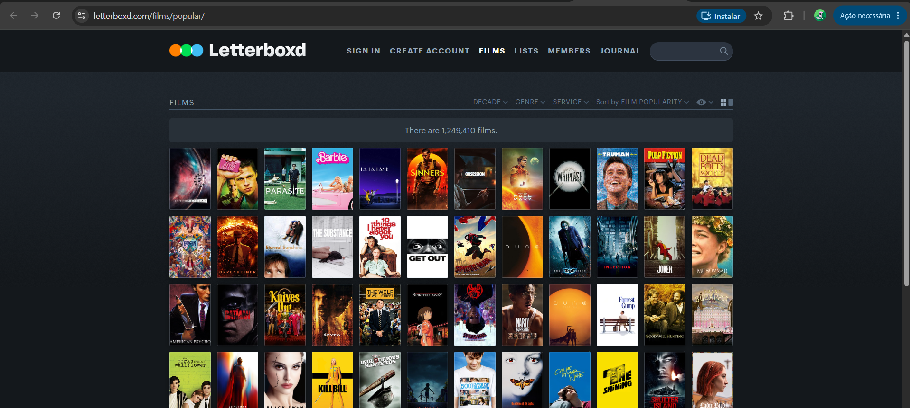
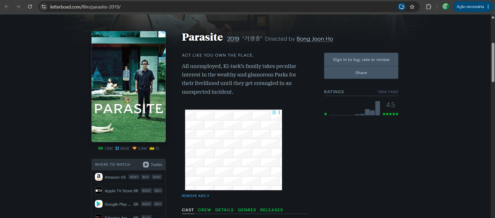
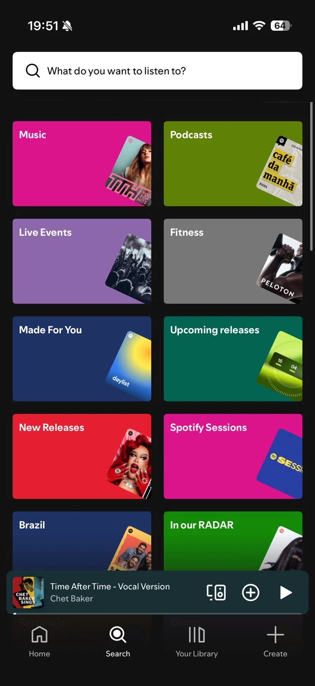
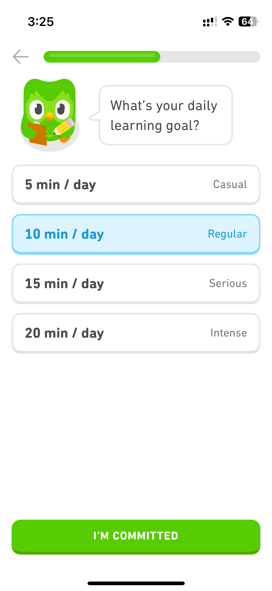
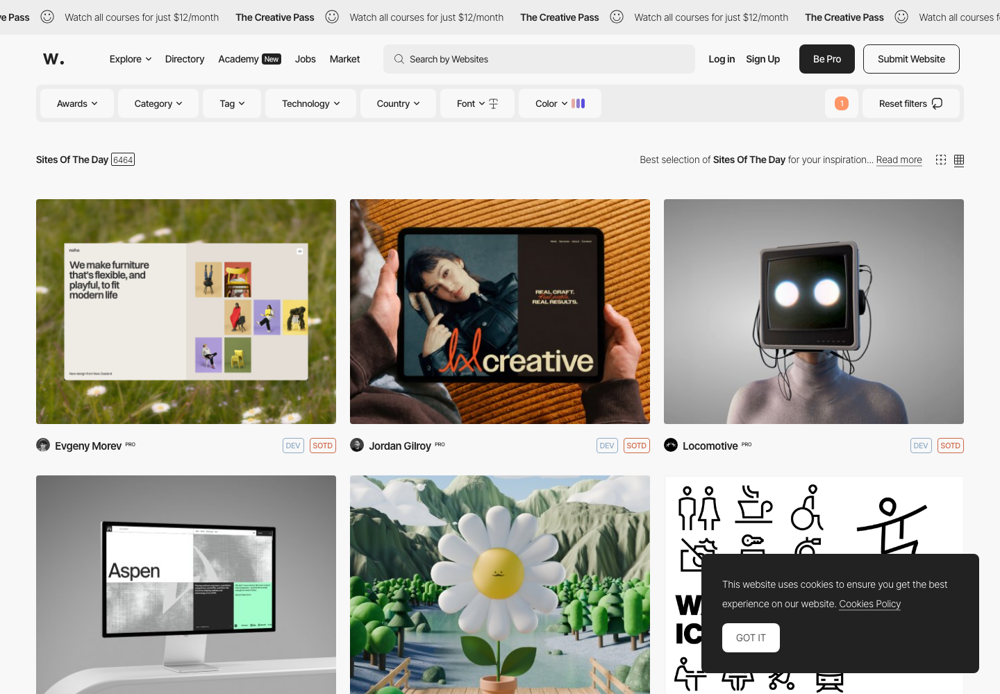
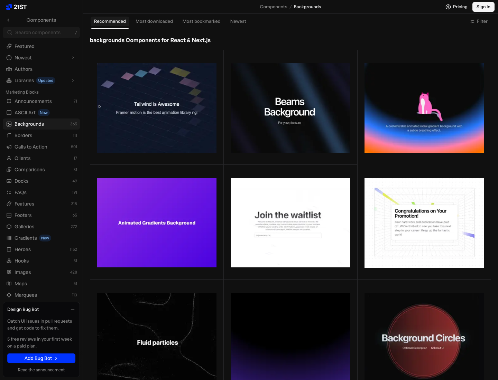
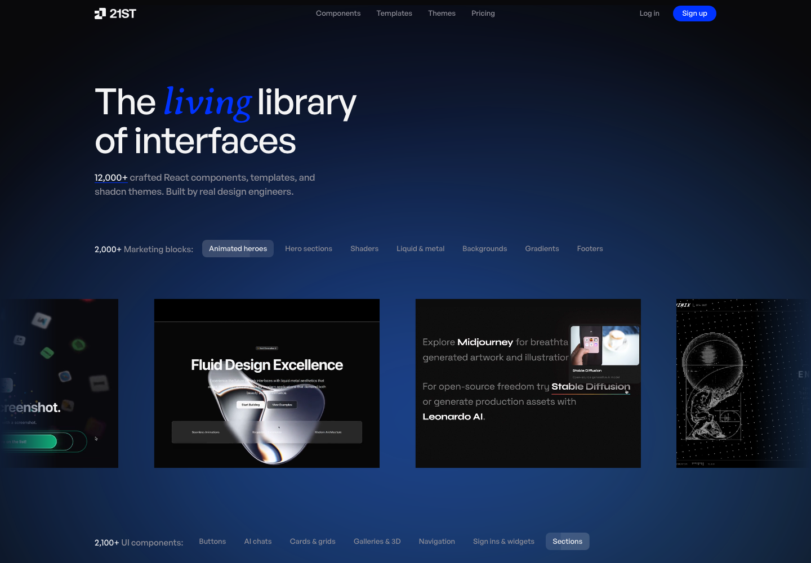

# References — WatchNext

## 1. Objetivo

As referências abaixo orientam as decisões de experiência e interface do
WatchNext. Nenhuma delas é do universo de filmes/séries (exceto a
primeira, usada como referência de layout de detalhe, não de
funcionalidade), conforme permitido pelo enunciado.

## 2. Referência 01 — Letterboxd

### Fonte
https://letterboxd.com/films/popular/ (grade de pôsteres)

### Imagem

### O que observamos?
O Letterboxd não usa listas com texto para representar filmes, usa uma
grade de pôsteres, grande o bastante para reconhecer o filme
visualmente antes mesmo de ler o nome. Na página de detalhe, o pôster
fica fixo ao lado do texto (não acima dele), com gêneros exibidos como
tags e a sinopse em destaque central.

### O que vamos aproveitar?
A ideia de que o pôster é o elemento de navegação principal, tanto na
listagem quanto no detalhe, e que gêneros funcionam melhor como tags
curtas do que como texto corrido.

### Como será adaptado?
No `GradeTitulos`/`CardTitulo`, os resultados da busca e a Minha Lista usam
uma grade de pôsteres como elemento visual principal, com nome e nota
como informação secundária abaixo da imagem. Na `PaginaDetalhes`, o layout
usa duas colunas (pôster fixo à esquerda, informações à direita), com
gêneros como tags, mesma hierarquia observada na referência.

## 3. Referência 02 — Spotify

### Fonte
Aba "Buscar" do Spotify, seção de gêneros e humores (mood & genre)

### Imagem

### O que observamos?
O Spotify organiza parte da descoberta de música por humor e contexto
("Foco", "Treino", "Relaxar"), não apenas por artista ou gênero —
reconhecendo que a pessoa muitas vezes sabe o clima que quer antes de
saber o título exato.

### O que vamos aproveitar?
A pergunta "qual seu humor agora" como critério de busca de primeira
classe, tão importante quanto gênero, em vez de escondida como filtro
secundário.

### Como será adaptado?
Na página `PaginaDescobrir`, o filtro de humor (`HUMORES`, em
`src/components/tmdb.js`) é a primeira pergunta feita antes de
gênero ou duração. Cada humor é internamente traduzido em uma combinação
de gêneros da TMDB (já que a API não tem o conceito de "humor" nativo).

## 4. Referência 03 — Duolingo

### Fonte
Telas de onboarding do Duolingo ("por que você quer aprender", "quanto
tempo por dia")

### Imagem

### O que observamos?
Em vez de `<select>` ou checkboxes tradicionais, o Duolingo usa botões
arredondados ("pills") grandes, com um estado visualmente óbvio de
selecionado/não selecionado — o que torna um formulário potencialmente
chato em algo rápido de preencher no toque.

### O que vamos aproveitar?
O padrão de pill buttons para qualquer escolha única ou múltipla dentro
de um formulário curto, priorizando velocidade de preenchimento no
celular.

### Como será adaptado?
Todo o formulário da página `PaginaDescobrir` (tipo de conteúdo, humor, tempo
disponível, gêneros extras) usa esse padrão (classe `.pill`,
em `src/App.css`) em vez de selects ou checkboxes, com estado
ativo destacado pela cor de destaque do produto.

## 5. Referência 04 — Awwwards (Sites of the Day)

### Fonte
https://www.awwwards.com/websites/sites_of_the_day/ — e dois dos sites
premiados abertos para estudo: **L.I.S.A.** (https://lisa.locomotive.ca)
e **Gionatan Nese '26** (https://www.gionatannese.com).

### Imagem

### O que observamos?
O que mais separa esses sites de um site comum não é a decoração, é a
**estrutura**. Nenhum deles abre com a pilha "rótulo pequeno → título →
parágrafo → botão colorido", que é o formato padrão de página de produto.
Em vez disso:

- a barra de navegação some para os cantos (marca num canto, menu no
  outro) e o meio da tela fica para o conteúdo;
- o **conteúdo entra primeiro**, ocupando a largura inteira, sem margem
  lateral; o texto vira legenda, não propaganda;
- a saída é um **link sublinhado**, não um botão preenchido;
- textos de apoio são tratados como ficha técnica: caixa alta, corpo
  pequeno, muito espaço entre as letras, separados por fios finos.

Junto disso aparecem três recursos de acabamento: linhas de texto ou
imagem que **correm sem parar na horizontal**, manchetes com linhas
**vazadas** (só o contorno das letras) e uma camada de **grão** por cima
de tudo, que tira o aspecto chapado do fundo escuro.

### O que vamos aproveitar?
A estrutura, principalmente. Nossa página inicial estava com o formato
padrão de página de produto, e era isso que a fazia parecer um modelo
pronto — a decoração não resolvia. Vamos inverter: o conteúdo real do
produto (os pôsteres vindos da API) abre a página, e o texto vira legenda.

### Como será adaptado?
- A home abre com uma **parede de pôsteres** em duas filas correndo em
  sentidos opostos, sangrando a largura da tela
  (`src/components/ParedeDePosteres.jsx` e `FilaDePosteres.jsx`, com
  `.parede` e `.fila` em `src/App.css`). Os títulos vêm do endpoint
  `/trending/all/week` da TMDB, buscados com `useEffect` na
  `PaginaInicio`. Os pôsteres entram em preto e branco e escurecidos, e
  recuperam a cor quando o mouse passa; a animação pausa no hover.
- O texto veio para **depois** do conteúdo e virou uma ficha: uma linha
  de meta no topo (assunto à esquerda, quantos títulos a parede está
  mostrando à direita — dado real vindo da API, não um número de índice
  decorativo), a manchete em
  duas linhas na fonte condensada Bebas Neue com a segunda linha vazada
  (`.titulo-contorno`, com `-webkit-text-stroke`), e um rodapé em duas
  colunas — explicação à esquerda, saída à direita.
- A saída deixou de ser um botão vermelho preenchido e virou uma
  **pílula vazada** (`.botao-seta`): no hover um preenchimento sobe de
  baixo e tanto o rótulo quanto a seta são trocados por uma segunda
  cópia que entra deslizando, empilhadas na mesma célula de grade.
- A caixa de filtros da página de descoberta deixou de ser um cartão com
  quatro blocos iguais empilhados e virou um **painel de controle**: uma
  grade de duas colunas com os campos separados por fios de 1px, uma
  faixa de cabeçalho mostrando o humor selecionado e as legendas
  numeradas 01 a 04 pelo próprio CSS (`counter`), na cor de destaque —
  o mesmo tratamento de índice usado na home (`.filters-form` em
  `src/App.css`).
- O fio embaixo da linha de meta recebe um facho de luz que atravessa
  devagar, animando a variável `--brilho` (registrada com `@property`).
- O mesmo contorno vazado é reaproveitado no título da página 404.
- Grão gerado por um ruído em SVG (`feTurbulence`) aplicado em
  `body::after` com `mix-blend-mode: overlay`, em `src/index.css`.

Escolhemos uma fonte condensada para o texto vazado, e não uma sem serifa
pesada: em corpo grande e vazado, hastes grossas e próximas viram um
amontoado de linhas finas e a palavra fica difícil de ler.

## 6. Referência 05 — 21st.dev

### Fonte
https://21st.dev/ e a categoria de fundos em https://21st.dev/s/backgrounds
— biblioteca de componentes React mantida por design engineers.

### Imagem

### O que observamos?
O componente mais salvo da categoria de fundos é o **Aurora Background**
("animated radial gradient background with a subtle breathing effect"):
manchas grandes de cor, muito desfocadas, que se movem devagar atrás do
conteúdo, normalmente combinadas com uma malha de linhas finas que some
nas bordas (padrão do "Kinetic Grid"). O fundo deixa de ser uma cor
chapada e ganha profundidade, sem roubar a atenção do texto. Além disso,
a galeria do próprio site escurece todos os cartões e destaca só aquele
em que o mouse está — um "holofote" que resolve o problema de uma grade
com muitos itens competindo entre si.

### O que vamos aproveitar?
O fundo em aurora com malha, porque nossas telas são escuras e vazias por
natureza (a cor vem só dos pôsteres), e o holofote na grade, que é
exatamente o nosso problema na página de descoberta, onde 20 pôsteres
coloridos aparecem de uma vez.

### Como será adaptado?
- `src/components/FundoAnimado.jsx` monta três manchas de cor (vermelho,
  roxo e o verde de destaque) e uma malha de linhas. Todo o movimento
  está no CSS (`.fundo-brilho`, `.fundo-grade` em `src/App.css`): as
  manchas usam `filter: blur(100px)` e animações lentas de `transform`
  com durações diferentes (19s, 23s e 27s), para o ciclo nunca se
  repetir igual; a malha desliza e usa `mask-image` para sumir em
  direção às bordas. O componente é `aria-hidden` porque é decoração.
- Na grade de resultados, os pôsteres entram dessaturados e, quando o
  mouse está em um cartão, os outros perdem cor e opacidade
  (`.title-grid:has(.title-card:hover) .title-card:not(:hover)`, em
  `src/App.css`). O cartão ativo recupera a cor, sobe alguns pixels e
  ganha borda na cor de destaque.
